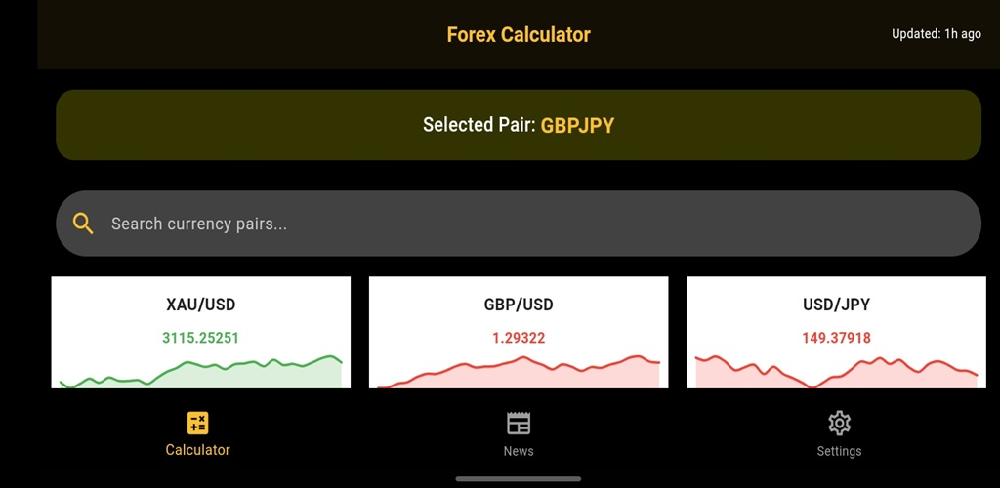
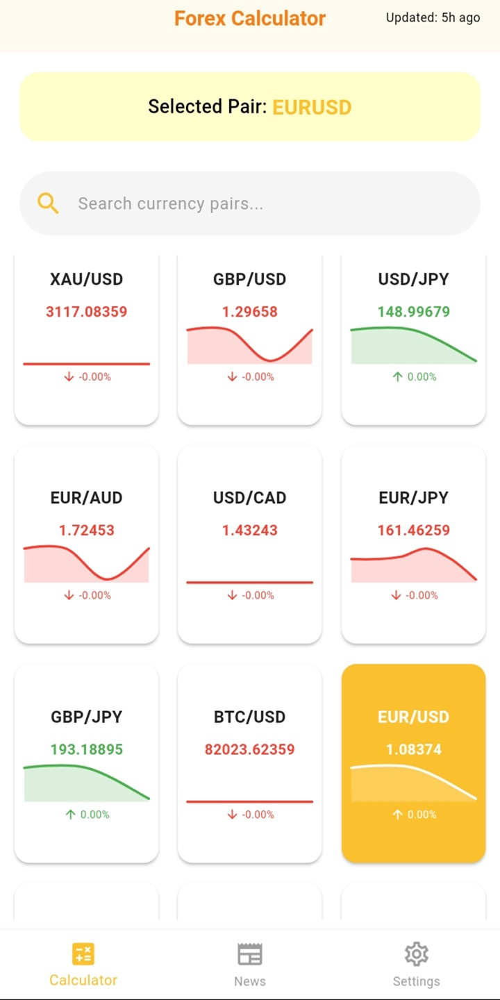
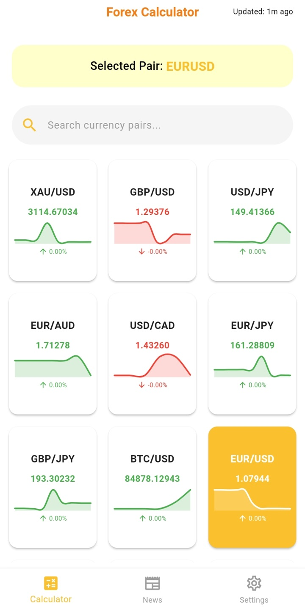
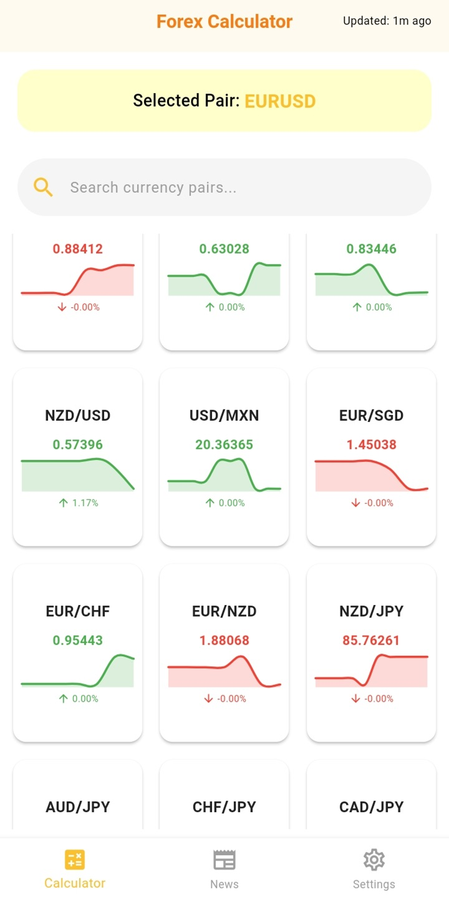
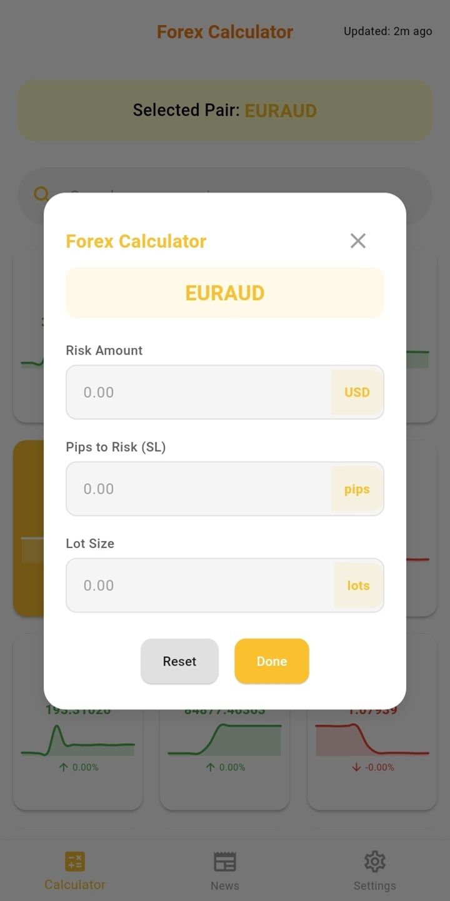
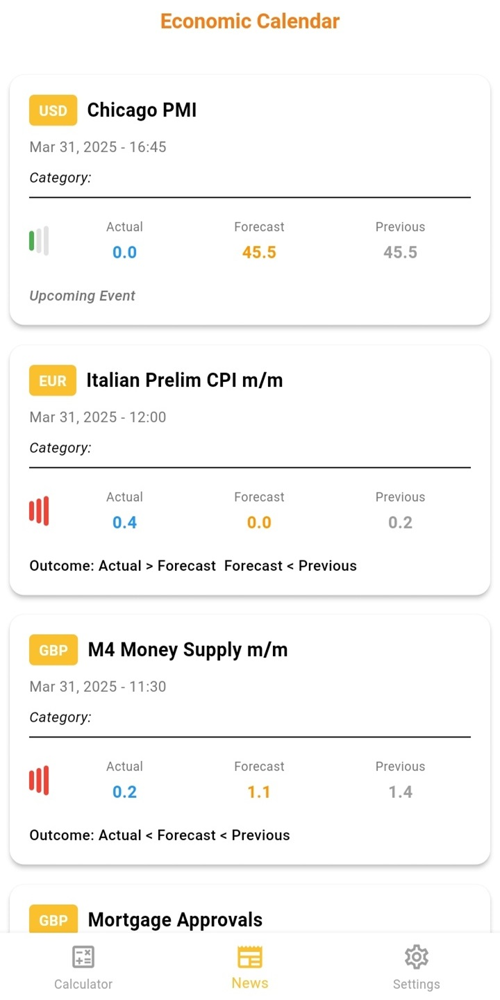
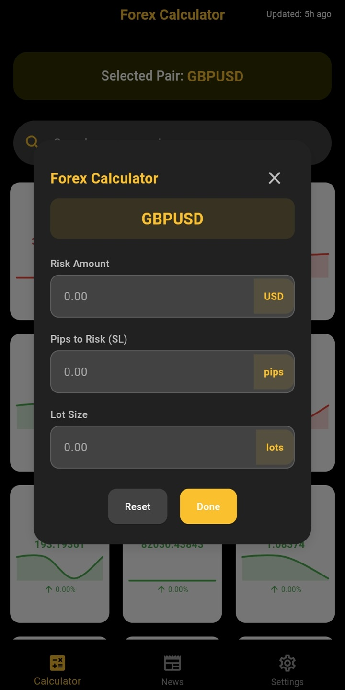
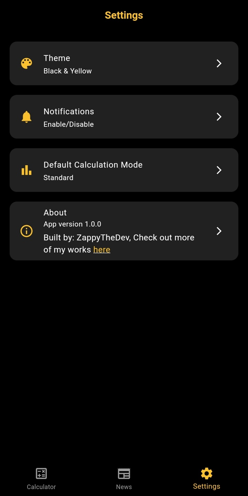
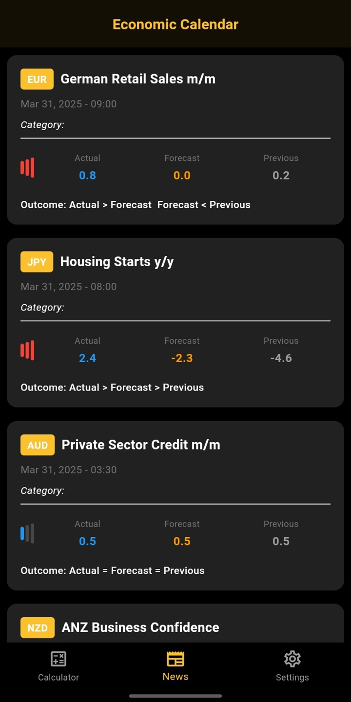

# ZForex Calculator Pro

A professional-grade forex trading calculator app providing accurate lot sizing, pip value calculations, risk assessment, real-time currency data, and an economic calendar.

## Features

- **Precise Risk Calculation**: Calculate lot sizes, pip values, and risk amounts with accuracy
- **Real-Time Currency Data**: Access up-to-the-minute exchange rates for all trading pairs
- **Economic Calendar**: Stay informed about market-moving events and financial news
- **Customizable Interface**: Switch between light and dark themes based on your preference
- **Risk Management Tools**: Set and track your risk parameters effectively
- **User-Friendly Design**: Clean, intuitive interface suitable for all trader types

## Screenshots

  
  
  
  
  
  
  
  

## Installation

## How It Works

Forex Calculator Pro simplifies the process of calculating trading parameters:

1. Enter your account balance and desired risk percentage
2. Select your currency pair and input stop loss in pips
3. Get instant calculations for lot size and risk amount
4. Check economic calendar for upcoming market-moving events
5. Use real-time currency rates for precise calculations

## Development

This application is built using [Flutter] with a focus on accuracy and user experience. We prioritize reliable calculations and real-time data to support trader decision-making.

## Feedback & Support

We welcome your feedback and suggestions! For support, please contact us at:

- Email: adezapelectronics@gmail.com
- Create an issue on this repository

## Privacy Policy

View our [Privacy Policy](https://www.termsfeed.com/live/4ea9bc31-5387-4012-9d2c-dbe98ef65a19) for information on how we handle user data.

## License

This project is licensed under the MIT License - see the [LICENSE](LICENSE) file for details.

---

© 2025 ZappyTheDev | All Rights Reserved

